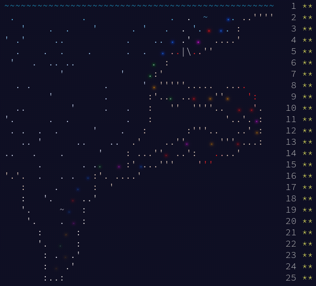

# Advent of Code 2021
These are my solutions to Advent of Code 2021, delivered in my favourite format of a web API
for no particular reason other than me wanting to play around with Ktor.

All challenges are reachable on `GET http://localhost:8080/day/{day}/part/{part}`, the input
data is located in `src/main/resources`.

If you want to you can use `runner.sh` to run the commands, it's a lot easier than running it
through a browser or Postman.

## [Day 18: Snailfish](src/main/kotlin/solution/day18) ([problem](https://adventofcode.com/2021/day/18))
Just coming up with a model for representing these numbers was tough. However once I'd settled on
something like `data class SFNumber(val left: SFNumber?, val right: SFNumber?, literal: Long?)` it
didn't take that long to work out the arithmetic. The explosions are the most difficult part due
to difficulties in finding "nearest right/left neighbor".

## [Day 19: Beacon Scanner](src/main/kotlin/solution/day19) ([problem](https://adventofcode.com/2021/day/19))
This one completely fried my brain with rotating objects in 3D space and fitting them together. A
lot of the work can be done in 2D, then just adding another dimension, but especially finding all
possible constellations/rotations of beacons was very difficult for me. In the end I generated
a lot of duplicates and used a set to narrow it down.

## [Day 21: Dirac Dice](src/main/kotlin/solution/day21) ([problem](https://adventofcode.com/2021/day/21))
Specifically part 2, part 1 is trivial for this one. In part 2 every roll of the dice splits the universe
into three possible outcomes.

My main problem with this was that I spent a lot of time trying to find a non-bruteforce solution because
I thought the number of universes would be too much. But it turns out that if you just remove duplicate
states it's not too bad.

## [Day 23: Amphipod](src/main/kotlin/solution/day23) ([problem](https://adventofcode.com/2022/day/23))
This one took FOREVER. Probably the most time spent on a single problem this year. Modelling the corridor
and rooms itself took two or three attempts until I had a model I was satisfied with. I then realized
all available actions were 1) moving from room to corridor, 2) moving from corridor to room, plus an
additional shortcut action of moving from room to room (which avoids splitting into multiple possible
room to corridor moves).

The shortcut for some reason ended up costing me a huge amount of coding time because for some reason I
couldn't get it to work. I eventually ditched it completely and went with a more brute-force-y solution.
It's not very fast, but not super slow either.

## [Day 24: Arithmetic Logic Unit](src/main/kotlin/solution/day24) ([problem](https://adventofcode.com/2022/day/24))
This one was similar to Dirac Dice in that I thought a brute force solution would be too slow, but then
it ended up being the only reasonable general solution. It seems some people have gone all out and built
a compiler for the elf code, complete with optimizations etc. Others have analyzed their input, building
a solution that doesn't work for other inputs.

All in all it takes about 4 minutes to run my solution, which I think is by far my slowest one this year.
But it does run.
